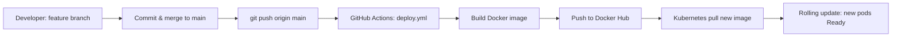

# Newspaper Delivery System — Complete DevOps Demonstration Script

**Project:** Newspaper Subscription Management (Node.js 18)  
**Docker image:** `dharshini24/newspaper-app:latest`  
**Repository:** https://github.com/Dharshh245/newspaper_delivery  
**CI/CD:** `.github/workflows/deploy.yml` (triggers on push to `main`)

> **Important:** This script does **not** change Git `user.name`, `user.email`, credentials, tokens, or GitHub authentication. Use your existing setup.

> **Prerequisite:** Open PowerShell in the project folder:
> ```powershell
> cd "c:\Users\dhars\Downloads\KCT_SRS_Newspaper Project"
> ```

---

## Part 1 — Git Branching Workflow

Git branching shows how developers work on features in isolation, then integrate into `main` for production/CI/CD.

---

### Step 1.1 — Show existing branches

| Item | Detail |
|------|--------|
| **Command** | `git branch -a` |
| **Purpose** | Lists local and remote branches. |
| **Expected output** | `* main` (current branch) and `remotes/origin/main`. |
| **Viva explanation** | `main` is the stable branch. Remote branches (`origin/...`) live on GitHub. The `*` marks your current branch. |

---

### Step 1.2 — Create branch `feature-update`

| Item | Detail |
|------|--------|
| **Command** | `git branch feature-update` |
| **Purpose** | Creates a new branch pointer at the current commit without switching. |
| **Expected output** | (no output — success is silent) |
| **Viva explanation** | Branching copies the commit history line so new work does not disturb `main` until merge. |

**Alternative (create + switch in one step):**

```powershell
git checkout -b feature-update
```

---

### Step 1.3 — Switch to `feature-update`

| Item | Detail |
|------|--------|
| **Command** | `git checkout feature-update` |
| **Purpose** | Moves your working tree to the feature branch. |
| **Expected output** | `Switched to branch 'feature-update'` |
| **Viva explanation** | All new commits will belong to `feature-update` until you switch branches. |

---

### Step 1.4 — Make a small change (demo change)

| Item | Detail |
|------|--------|
| **Command** | `Add-Content -Path README.md -Value "`n## Feature update (demo branch)`""` |
| **Purpose** | Simulates real development (documentation or code change). |
| **Expected output** | (no output) |
| **Viva explanation** | Faculty expects a visible change on the feature branch before commit. |

*Or edit `package.json` version, e.g. `1.0.9` → `1.0.10`.*

---

### Step 1.5 — Check status

| Item | Detail |
|------|--------|
| **Command** | `git status` |
| **Purpose** | Shows modified/untracked files and current branch. |
| **Expected output** | `On branch feature-update` and `modified: README.md` (or your file) under "Changes not staged". |
| **Viva explanation** | Confirms you are on the correct branch and what will be committed. |

---

### Step 1.6 — Stage files

| Item | Detail |
|------|--------|
| **Command** | `git add README.md` |
| **Purpose** | Stages selected files for the next commit. |
| **Expected output** | (no output) |
| **Viva explanation** | `git add` moves changes to the staging area (index) before commit. |

**Stage all changes:**

```powershell
git add .
```

---

### Step 1.7 — Commit on feature branch

| Item | Detail |
|------|--------|
| **Command** | `git commit -m "feat: demo update on feature-update branch"` |
| **Purpose** | Saves a snapshot on `feature-update` with a message. |
| **Expected output** | `[feature-update <hash>] feat: demo update...` and file count. |
| **Viva explanation** | Each commit is a versioned checkpoint; feature work stays off `main` until merge. |

---

### Step 1.8 — View commit history

| Item | Detail |
|------|--------|
| **Command** | `git log --oneline --graph --all -10` |
| **Purpose** | Shows recent commits and branch structure. |
| **Expected output** | Graph with `feature-update` ahead of `main` by one commit. |
| **Viva explanation** | Proves branching history — useful in review to show parallel development. |

---

### Step 1.9 — Switch back to `main`

| Item | Detail |
|------|--------|
| **Command** | `git checkout main` |
| **Purpose** | Return to production branch before merge. |
| **Expected output** | `Switched to branch 'main'` |
| **Viva explanation** | Merge is typically done from `main` after feature is complete and reviewed. |

---

### Step 1.10 — Merge `feature-update` into `main`

| Item | Detail |
|------|--------|
| **Command** | `git merge feature-update` |
| **Purpose** | Integrates feature commits into `main`. |
| **Expected output** | `Fast-forward` or merge commit message; lists files changed. |
| **Viva explanation** | Merge combines histories; `main` now includes the feature for deployment/CI. |

---

### Step 1.11 — Delete feature branch (optional)

| Item | Detail |
|------|--------|
| **Command** | `git branch -d feature-update` |
| **Purpose** | Removes local branch after successful merge. |
| **Expected output** | `Deleted branch feature-update` |
| **Viva explanation** | Keeps repo tidy; remote feature branches can be deleted on GitHub similarly. |

---

### Step 1.12 — Push `main` to GitHub

| Item | Detail |
|------|--------|
| **Command** | `git push origin main` |
| **Purpose** | Uploads merged `main` to GitHub; **triggers CI/CD** (see Part 4). |
| **Expected output** | `main -> main` with object enumeration. |
| **Viva explanation** | Remote `main` is the source of truth for GitHub Actions and team collaboration. |

---

## Part 2 — Docker Workflow

Docker packages the Node.js app and dependencies into a portable image.

---

### Step 2.1 — Build image

| Item | Detail |
|------|--------|
| **Command** | `docker build -t dharshini24/newspaper-app:latest .` |
| **Purpose** | Builds image from `Dockerfile` (Node 18, Linux `npm ci`, bcrypt fix via `.dockerignore`). |
| **Expected output** | Steps `#1`–`#N`, ends with `exporting to image` and `naming to docker.io/dharshini24/newspaper-app:latest`. |
| **Viva explanation** | Image is immutable artifact used the same way on laptop, CI, and Kubernetes. |

---

### Step 2.2 — List images

| Item | Detail |
|------|--------|
| **Command** | `docker images dharshini24/newspaper-app` |
| **Purpose** | Verifies image exists locally. |
| **Expected output** | Row with `REPOSITORY`, `TAG latest`, `SIZE` (~180–400MB). |
| **Viva explanation** | Confirms build succeeded before run/push. |

---

### Step 2.3 — Run container (local test)

| Item | Detail |
|------|--------|
| **Command** | `docker run -d --name newspaper-demo -p 3000:3000 -e MONGODB_URI=mongodb://host.docker.internal:27017/newspaper dharshini24/newspaper-app:latest` |
| **Purpose** | Runs app in background; maps port 3000. Mongo on host optional for full login demo. |
| **Expected output** | Long container ID printed. |
| **Viva explanation** | `-d` detached, `-p` publishes port, `-e` sets environment variables. |

*Without local Mongo, container may still start; DB features need Mongo.*

---

### Step 2.4 — Verify application is running

| Item | Detail |
|------|--------|
| **Command** | `docker logs newspaper-demo --tail 20` |
| **Purpose** | Checks container stdout. |
| **Expected output** | `Server running on port 3000` |
| **Viva explanation** | Logs prove the process started inside the container. |

**HTTP check (PowerShell):**

```powershell
curl.exe -s -o NUL -w "%{http_code}" http://localhost:3000/
```

| **Expected output** | `200` |
| **Viva explanation** | HTTP 200 means the web server responds — app is reachable. |

---

### Step 2.5 — Stop and remove container

| Item | Detail |
|------|--------|
| **Command** | `docker stop newspaper-demo` |
| **Purpose** | Stops running container. |
| **Expected output** | `newspaper-demo` |
| **Viva explanation** | Frees port 3000 for next demo steps. |

```powershell
docker rm newspaper-demo
```

| **Purpose** | Removes stopped container. |

---

### Step 2.6 — Tag image (optional extra tag)

| Item | Detail |
|------|--------|
| **Command** | `docker tag dharshini24/newspaper-app:latest dharshini24/newspaper-app:v1.0` |
| **Purpose** | Creates version tag pointing to same image ID. |
| **Expected output** | (silent success) |
| **Viva explanation** | Tags are aliases; Kubernetes/CI can pin `v1.0` instead of `latest`. |

---

### Step 2.7 — Push to Docker Hub

| Item | Detail |
|------|--------|
| **Command** | `docker login` |
| **Purpose** | Authenticates to Docker Hub (use existing credentials — **do not change Git config**). |
| **Expected output** | `Login Succeeded` |

```powershell
docker push dharshini24/newspaper-app:latest
```

| **Expected output** | Layer upload progress, `latest: digest: sha256:... size: ...` |
| **Viva explanation** | Registry stores image so AKS/Kubernetes can `pull` without building on cluster. |

---

## Part 3 — Kubernetes Workflow

**Cluster:** AKS context `newspaper-aks` (or Docker Desktop).  
**Note:** Deploy **MongoDB first** — app uses `mongodb://mongo-service:27017/newspaper`.

---

### Step 3.1 — Check cluster connection

| Item | Detail |
|------|--------|
| **Command** | `kubectl cluster-info` |
| **Purpose** | Confirms `kubectl` talks to the cluster API. |
| **Expected output** | `Kubernetes control plane is running at https://...` |
| **Viva explanation** | Without API access, no deploy/scale commands work. |

```powershell
kubectl config current-context
```

| **Expected output** | `newspaper-aks` (or `docker-desktop`) |

---

### Step 3.2 — View nodes

| Item | Detail |
|------|--------|
| **Command** | `kubectl get nodes` |
| **Purpose** | Lists worker nodes (VMs) that run pods. |
| **Expected output** | `NAME`, `STATUS Ready`, `ROLES`, `VERSION` |
| **Viva explanation** | Pods are scheduled onto nodes; AKS shows VMSS node names. |

---

### Step 3.3 — Deploy MongoDB (required before app)

| Item | Detail |
|------|--------|
| **Command** | `kubectl apply -f mongo-deployment.yml -f mongo-service.yml` |
| **Purpose** | Creates MongoDB pod and ClusterIP service `mongo-service`. |
| **Expected output** | `deployment.apps/mongo-deployment created`, `service/mongo-service created` |
| **Viva explanation** | App crashes with `ENOTFOUND mongo-service` if Mongo is missing. |

---

### Step 3.4 — Apply deployment and service

| Item | Detail |
|------|--------|
| **Command** | `kubectl apply -f deployment.yml` |
| **Purpose** | Creates/updates `newspaper-deployment` (image, env, probes, replicas). |
| **Expected output** | `deployment.apps/newspaper-deployment configured` or `created` |

```powershell
kubectl apply -f service.yml
```

| **Expected output** | `service/newspaper-service created` or `unchanged` |
| **Viva explanation** | Deployment manages pods; Service exposes them (LoadBalancer on AKS). |

---

### Step 3.5 — Verify deployment

| Item | Detail |
|------|--------|
| **Command** | `kubectl get deployments` |
| **Purpose** | Shows desired vs ready replicas. |
| **Expected output** | `newspaper-deployment` `READY 3/3` (after rollout), `mongo-deployment` `1/1` |

```powershell
kubectl describe deployment newspaper-deployment
```

| **Viva explanation** | Shows image `dharshini24/newspaper-app:latest`, env `MONGODB_URI`, events. |

---

### Step 3.6 — Verify pods

| Item | Detail |
|------|--------|
| **Command** | `kubectl get pods -l app=newspaper-app` |
| **Purpose** | Lists app pods and readiness. |
| **Expected output** | Three pods `STATUS Running`, `READY 1/1` |
| **Viva explanation** | `READY 1/1` means container passed readiness probe (HTTP `/`). |

---

### Step 3.7 — Verify services

| Item | Detail |
|------|--------|
| **Command** | `kubectl get svc` |
| **Purpose** | Shows ClusterIP/LoadBalancer endpoints. |
| **Expected output** | `newspaper-service` `TYPE LoadBalancer` `EXTERNAL-IP` (e.g. `20.x.x.x`) `PORT 80` |
| **Viva explanation** | LoadBalancer gives public IP on AKS; routes port 80 → pod port 3000. |

---

### Step 3.8 — View logs

| Item | Detail |
|------|--------|
| **Command** | `kubectl logs -l app=newspaper-app --tail=30` |
| **Purpose** | Aggregates recent logs from app pods. |
| **Expected output** | `Server running on port 3000` |
| **Viva explanation** | Used for debugging CrashLoopBackOff, Mongo errors, bcrypt issues. |

---

### Step 3.9 — Scale from 1 pod to 3 pods (live demo)

**For demonstration**, scale down first, then up:

| Item | Detail |
|------|--------|
| **Command** | `kubectl scale deployment newspaper-deployment --replicas=1` |
| **Purpose** | Sets running pod count to 1. |
| **Expected output** | `deployment.apps/newspaper-deployment scaled` |

```powershell
kubectl get pods -l app=newspaper-app -w
```

(Press `Ctrl+C` when one pod is `Running`.)

```powershell
kubectl scale deployment newspaper-deployment --replicas=3
```

| **Purpose** | Demonstrates horizontal scaling. |
| **Expected output** | Three pods `Running`, `READY 1/1` |

```powershell
kubectl get pods -l app=newspaper-app
```

| **Viva explanation** | Scaling increases capacity and availability; Kubernetes schedules new pods on nodes. |

---

### Step 3.10 — Access application through service

| Item | Detail |
|------|--------|
| **Command** | `kubectl get svc newspaper-service` |
| **Purpose** | Get `EXTERNAL-IP` for LoadBalancer. |
| **Expected output** | `EXTERNAL-IP` populated (may take 1–2 min on AKS) |

**Browser:** `http://<EXTERNAL-IP>/`

**Port-forward (if no external IP):**

```powershell
kubectl port-forward svc/newspaper-service 8080:80
```

Open: http://127.0.0.1:8080/

| **Viva explanation** | Service is stable DNS/IP; pods behind it can scale or restart without changing the client URL. |

---

### Step 3.11 — Delete resources (cleanup demo)

| Item | Detail |
|------|--------|
| **Command** | `kubectl delete -f service.yml -f deployment.yml` |
| **Purpose** | Removes app Service and Deployment (pods terminated). |
| **Expected output** | `service "newspaper-service" deleted`, `deployment.apps "newspaper-deployment" deleted` |

```powershell
kubectl delete -f mongo-service.yml -f mongo-deployment.yml
```

| **Viva explanation** | `kubectl delete -f` uses manifest labels/selectors — good practice for reproducible teardown. |

---

## Part 4 — CI/CD Pipeline Explanation (Git → Docker Hub → Kubernetes)

### End-to-end flow (real-world)



| Stage | What happens | Your project |
|-------|----------------|--------------|
| 1. Feature branch | Developer works on `feature-update` | Part 1 |
| 2. Commit | Code change saved with message | `git commit` |
| 3. Merge to `main` | Integration branch updated | `git merge feature-update` |
| 4. Push to GitHub | Remote triggers workflow | `git push origin main` |
| 5. Pipeline trigger | `on: push: branches: [main]` | `.github/workflows/deploy.yml` |
| 6. Docker build | Buildx builds from `Dockerfile` | Job `build-and-push` |
| 7. Docker push | Image `dharshini24/newspaper-app:latest` | Secrets `DOCKER_USERNAME`, `DOCKER_PASSWORD` |
| 8. K8s update | Cluster pulls new image | `kubectl rollout restart` or `imagePullPolicy: Always` |
| 9. Verify pods | Rolling update replaces pods | `kubectl get pods` → `3/3 Running` |

### Verify CI/CD after push

| Item | Detail |
|------|--------|
| **Command** | Open https://github.com/Dharshh245/newspaper_delivery/actions |
| **Purpose** | Show workflow run status. |
| **Expected output** | Green check on **CI/CD Pipeline** — build and push succeeded. |
| **Viva explanation** | Automates repeatable builds; removes manual `docker build` on every release. |

### Update Kubernetes after CI push

```powershell
kubectl rollout restart deployment/newspaper-deployment
kubectl rollout status deployment/newspaper-deployment --timeout=300s
kubectl get pods -l app=newspaper-app
```

| **Expected output** | New pod ages, `READY 1/1`, image pulled recently |
| **Viva explanation** | `rollout restart` forces pods to recreate and pull `latest` from Docker Hub. |

### Secrets used (no changes required)

| Secret | Used for |
|--------|----------|
| `DOCKER_USERNAME` | Docker Hub login in Actions |
| `DOCKER_PASSWORD` | Docker Hub token/password |
| `KUBECONFIG` | Optional — only if you add a deploy job to Actions |

**Current workflow:** build + push only (safe, does not break cluster). Full auto-deploy to AKS can be added later with `KUBECONFIG` and `kubectl apply` in a second job.

---

## Quick reference — one-page command list

```powershell
# Git
git branch -a
git checkout -b feature-update
git status
git add .
git commit -m "feat: demo update"
git log --oneline --graph -5
git checkout main
git merge feature-update
git push origin main

# Docker
docker build -t dharshini24/newspaper-app:latest .
docker images
docker run -d --name newspaper-demo -p 3000:3000 dharshini24/newspaper-app:latest
docker logs newspaper-demo
docker stop newspaper-demo; docker rm newspaper-demo
docker push dharshini24/newspaper-app:latest

# Kubernetes
kubectl cluster-info
kubectl get nodes
kubectl apply -f mongo-deployment.yml -f mongo-service.yml
kubectl apply -f deployment.yml -f service.yml
kubectl get deployments,pods,svc
kubectl logs -l app=newspaper-app --tail=20
kubectl scale deployment newspaper-deployment --replicas=1
kubectl scale deployment newspaper-deployment --replicas=3
kubectl rollout restart deployment/newspaper-deployment
```

---

## Common viva questions & answers

| Question | Answer |
|----------|--------|
| Why Git branching? | Isolates features; `main` stays deployable; supports code review and CI on merge. |
| Why Docker? | Same environment dev → CI → K8s; fixes “works on my machine”; bundles Node 18 + bcrypt for Linux. |
| Why Kubernetes? | Auto-restart, scaling (1→3), load balancing, rolling updates. |
| Why pods not Ready? | Often missing Mongo (`mongo-service`), image pull errors, or app not listening on `0.0.0.0:3000`. |
| What triggers CI/CD? | Push to `main` runs GitHub Actions; builds and pushes Docker image automatically. |

---

*End of demonstration script.*
